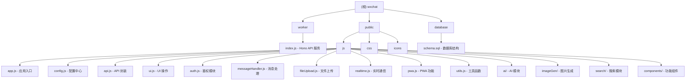

# 微信文件传输助手 - 项目文档

> 基于 Cloudflare Workers 的现代化微信消息处理服务

[根目录](./CLAUDE.md)

---

## 变更记录 (Changelog)

| 日期 | 版本 | 变更内容 |
|------|------|----------|
| 2026-02-05 | 1.0.0 | 初始文档生成，完成项目架构扫描 |

---

## 项目愿景

wxchat 是一个仿微信文件传输助手的 Web 应用，采用 Cloudflare Workers 边缘计算技术，实现跨设备文件传输和实时消息同步。项目采用零依赖前端设计，具备企业级安全、PWA 离线支持和 AI 智能对话能力。

---

## 架构总览

### 技术栈

| 层级 | 技术选型 | 说明 |
|------|----------|------|
| **前端** | HTML5 + CSS3 + JavaScript ES6+ | 零依赖、模块化设计 |
| **后端** | Hono + Cloudflare Workers | 边缘计算、毫秒级响应 |
| **数据库** | Cloudflare D1 (SQLite) | ACID 事务、全球分布 |
| **存储** | Cloudflare R2 | 对象存储、CDN 加速 |
| **部署** | Cloudflare Workers | 全球边缘节点部署 |

### 系统架构图

```
+-------------------+     +----------------------+     +------------------+
|   用户浏览器      |<--->|  Cloudflare Workers  |<--->|  Cloudflare D1   |
|   (PWA 支持)      |     |  (Hono 框架)         |     |  (SQLite 数据库) |
+-------------------+     +----------------------+     +------------------+
                                    |
                                    v
                          +------------------+
                          |  Cloudflare R2   |
                          |  (文件存储)      |
                          +------------------+
```

---

## 模块结构图



---

## 模块索引

| 模块路径 | 职责 | 入口文件 | 语言 |
|----------|------|----------|------|
| `worker/` | Hono API 后端服务 | `index.js` | JavaScript |
| `public/js/` | 前端 JavaScript 模块 | `app.js` | JavaScript |
| `public/js/ai/` | AI 对话功能 | `aiHandler.js` | JavaScript |
| `public/js/imageGen/` | AI 图片生成 | `imageGenHandler.js` | JavaScript |
| `public/js/search/` | 消息搜索功能 | `searchHandler.js` | JavaScript |
| `public/js/components/` | 功能组件 | `functionButton.js` | JavaScript |
| `public/css/` | 样式文件 | `main.css` | CSS |
| `database/` | 数据库结构定义 | `schema.sql` | SQL |

---

## 运行与开发

### 环境要求

- Node.js 18+
- Cloudflare 账户
- Wrangler CLI

### 快速开始

```bash
# 1. 克隆项目
git clone https://github.com/xiyewuqiu/wxchat.git
cd wxchat

# 2. 安装依赖
npm install

# 3. 登录 Cloudflare
npx wrangler login

# 4. 创建 D1 数据库
npx wrangler d1 create wxchat

# 5. 创建 R2 存储桶
npx wrangler r2 bucket create wxchat

# 6. 初始化数据库
npm run db:init

# 7. 本地开发
npm run dev

# 8. 部署生产
npm run deploy
```

### npm 脚本

| 命令 | 说明 |
|------|------|
| `npm run dev` | 启动本地开发服务器 |
| `npm run deploy` | 部署到 Cloudflare Workers |
| `npm run build` | 执行构建脚本 |
| `npm run db:init` | 初始化 D1 数据库 |

### 环境变量

在 `wrangler.toml` 或 Cloudflare Dashboard 中配置：

| 变量名 | 说明 | 示例 |
|--------|------|------|
| `ACCESS_PASSWORD` | 访问密码 | `your-password` |
| `JWT_SECRET` | JWT 签名密钥 | 32位以上随机字符串 |
| `SESSION_EXPIRE_HOURS` | 会话过期时间(小时) | `24` |
| `MAX_LOGIN_ATTEMPTS` | 最大登录尝试次数 | `5` |

---

## 测试策略

### 当前状态

项目目前没有自动化测试框架。建议添加：

- 单元测试：使用 Vitest 测试前端模块
- API 测试：使用 Miniflare 测试 Worker 接口
- E2E 测试：使用 Playwright 测试完整流程

### 手动测试

```bash
# 启动本地开发服务器后访问
http://localhost:8787

# 测试 API 健康检查
curl http://localhost:8787/api/health
```

---

## 编码规范

### JavaScript 规范

- 使用 ES6+ 语法（箭头函数、const/let、模板字符串）
- 模块使用单例对象模式（如 `const API = {...}`）
- 异步操作使用 async/await
- 错误处理使用 try-catch
- 对象冻结防止意外修改（`Object.freeze()`）

### CSS 规范

- 模块化样式文件（按功能拆分）
- 使用 CSS 变量实现主题
- 移动优先的响应式设计
- BEM 命名规范

### 文件命名

- JavaScript：camelCase（如 `messageHandler.js`）
- CSS：kebab-case（如 `ios-fixes.css`）
- 组件目录：复数形式（如 `components/`）

---

## API 接口概览

### 认证接口

| 方法 | 路径 | 说明 |
|------|------|------|
| POST | `/api/auth/login` | 登录认证 |
| GET | `/api/auth/verify` | 验证 Token |
| POST | `/api/auth/logout` | 登出 |

### 消息接口

| 方法 | 路径 | 说明 |
|------|------|------|
| GET | `/api/messages` | 获取消息列表 |
| POST | `/api/messages` | 发送文本消息 |
| POST | `/api/ai/message` | 发送 AI 消息 |

### 文件接口

| 方法 | 路径 | 说明 |
|------|------|------|
| POST | `/api/files/upload` | 上传文件 |
| GET | `/api/files/download/:r2Key` | 下载文件 |

### 其他接口

| 方法 | 路径 | 说明 |
|------|------|------|
| GET | `/api/search` | 搜索消息 |
| POST | `/api/sync` | 设备同步 |
| POST | `/api/clear-all` | 清空数据 |
| GET | `/api/events` | SSE 实时连接 |
| GET | `/api/poll` | 长轮询接口 |

---

## 数据模型

### messages 表

| 字段 | 类型 | 说明 |
|------|------|------|
| id | INTEGER | 主键 |
| type | TEXT | 消息类型 (text/file) |
| content | TEXT | 文本内容 |
| file_id | INTEGER | 关联文件 ID |
| device_id | TEXT | 发送设备 |
| timestamp | DATETIME | 时间戳 |

### files 表

| 字段 | 类型 | 说明 |
|------|------|------|
| id | INTEGER | 主键 |
| original_name | TEXT | 原始文件名 |
| file_size | INTEGER | 文件大小 |
| mime_type | TEXT | MIME 类型 |
| r2_key | TEXT | R2 存储键 |

### devices 表

| 字段 | 类型 | 说明 |
|------|------|------|
| id | TEXT | 设备 ID (主键) |
| name | TEXT | 设备名称 |
| last_active | DATETIME | 最后活跃时间 |

---

## AI 使用指引

### 项目特点

1. **单体架构**：后端为单文件 Hono 应用，前端为模块化 JS 文件
2. **无构建工具**：前端直接使用原生 ES6+，无需 Webpack/Vite
3. **状态管理**：使用全局对象单例模式，非 Redux/Vuex
4. **实时通信**：SSE + 长轮询双重保障

### 关键路径

- **入口点**：`worker/index.js`（后端）、`public/js/app.js`（前端）
- **配置中心**：`public/js/config.js`
- **API 层**：`public/js/api.js`
- **UI 层**：`public/js/ui.js`

### 修改建议

1. **添加新 API**：在 `worker/index.js` 中添加 Hono 路由
2. **添加前端功能**：创建新 JS 模块，在 `index.html` 中引入
3. **修改样式**：编辑对应 CSS 文件，遵循模块化原则
4. **数据库变更**：修改 `database/schema.sql`，重新初始化

### 注意事项

- 前端通知功能已禁用，避免移动端遮挡输入框
- 文件上传限制为 10MB（可在 CONFIG 中调整）
- JWT Token 存储在 localStorage
- PWA 安装通过 `/pwa` 命令触发

---

## 常见问题 (FAQ)

### Q: 如何修改访问密码？

在 Cloudflare Dashboard > Workers & Pages > wxchat > 设置 > 变量和机密 中修改 `ACCESS_PASSWORD`。

### Q: HTTP 500 错误如何解决？

通常是数据库未初始化，执行 `npm run db:init` 或在 D1 控制台手动执行 `schema.sql`。

### Q: 如何添加自定义域名？

```bash
npx wrangler route add "your-domain.com/*" wxchat
```

### Q: 本地开发如何连接远程数据库？

```bash
npx wrangler dev --remote
```

---

## 相关文件清单

### 配置文件

- `package.json` - npm 配置
- `wrangler.toml` - Cloudflare Workers 配置
- `build.js` - 构建脚本

### 核心代码

- `worker/index.js` - 后端 API 服务
- `public/js/app.js` - 前端应用入口
- `public/js/config.js` - 全局配置
- `database/schema.sql` - 数据库结构

### 文档

- `README.md` - 项目说明
- `LICENSE` - 开源许可证

---

## 覆盖率报告

### 扫描统计

| 指标 | 数值 |
|------|------|
| 总文件数（代码相关） | 约 30 个 |
| 已扫描文件数 | 25 个 |
| 覆盖率 | 约 83% |
| 语言占比 | JavaScript 90%, CSS 8%, SQL 2% |

### 未扫描目录

- `public/icons/` - 图标资源（已忽略二进制文件）
- `node_modules/` - 依赖包（已按规则忽略）
- `.git/` - Git 目录（已按规则忽略）

### 缺口分析

| 模块 | 状态 | 缺口 |
|------|------|------|
| worker/ | 已完成 | 无 |
| public/js/ | 已完成 | 无 |
| public/js/ai/ | 部分扫描 | 建议补充 aiAPI.js, aiUI.js |
| public/js/imageGen/ | 部分扫描 | 建议补充详细文档 |
| public/js/search/ | 部分扫描 | 建议补充详细文档 |
| public/css/ | 未详扫 | 可选补充样式文档 |

---

## 推荐下一步

1. **补充测试**：添加 Vitest 单元测试和 Playwright E2E 测试
2. **模块文档**：为 AI、图片生成、搜索模块生成独立 CLAUDE.md
3. **类型安全**：考虑迁移到 TypeScript 或添加 JSDoc 类型注释
4. **性能监控**：添加 Cloudflare Analytics 集成
5. **CI/CD**：配置 GitHub Actions 自动部署

---

*文档生成时间：2026-02-05 20:24:13*
*扫描工具：Claude Code 初始化架构师*
